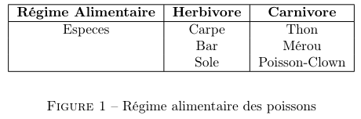
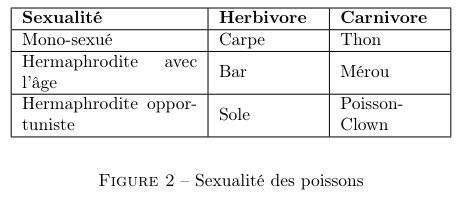
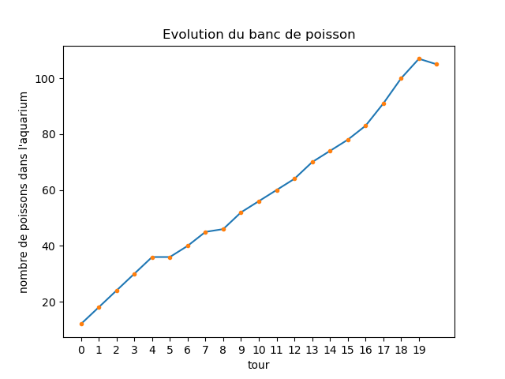

# Aquarium
Simulation de la vie marine dans le cadre du projet de spécialité de 2ème année

## Description de notre aquarium :
Dans notre jeu de simulation, il y a deux agents dénomés êtres vivants dans le reste du document : des algues et des poissons. Ces êtres vivants sont dotés d'un identifiant généré aléatoirement nous permettant de traquer chacun d'eux aini qu'un nombre de points de vie et un age.

Ces êtres vivants ont bien evidemment un état évolutif qui change en fonction du temps. Ils ont donc la malchance de pouvoir vieillir à chaque tour et doivent notamment manger tout en prenant le risque de se faire manger. Ils ont également la possibilité de se reproduire selon certaines règles.\\

Les algues (SeaWeed) :
- Gagnent 1 HP à la fin de chaque tour;
- Perdent 2 HP s'ils se font manger;
- Se reproduisent selon la règle suivante : si une algue a 10 HP ou plus, elle se sépare en deux pour donner naissance à une algue deux fois plus petite, donc avec deux fois moins de PV. Évidemment l'algue parente perds la moitié de ses HP dans le processus, mais garde son âge.\\

Les poissons (Fish) :
- Perdent 1 HP à la fin de chaque tour;
- Perdent 4 HP s'ils se font mordre par un autre poisson carnivore;
- Doit manger s'il a suffisamment faim (5 HP ou moins). Les herbivores n'ont pas trop de problème, mais les algues ne sont pas très nourrissantes : +3 HP. Les carnivores mangent de la bonne viande de poisson, qui fait gagner +5 HP. Un carnivore attaque chaque tour un poisson au hasard : il n'a qu'une seule chance. Hélas pour lui, il ne peut ni se manger lui-même, ni manger un poisson de son espèce. Le tableau des régimes alimentaires selon l'espece est donné dans la figure 1.
- Se reproduit selon certaines règles qui seront détaillées dans la section suivante.

Dans le cadre de notre jeu, les êtres vivants naissent à l'âge 0 et ceux qui ont plus de 20 tours meurent de vieillesse.

  

## Reproduction :

Un poisson qui n'a pas faim va aller voir un autre poisson (au hasard). Si ce poisson est de même race et de sexe opposé, les deux poissons se reproduisent et donnent naissance à un troisième poisson, de même race et de sexe aléatoire. Il n'a qu'un seul essai par tour et les conflits sont réglés selon le jeu des enchères à temps aléatoire.
Mais, biensur la séxualité chez les poissons n'est pas si simple que ça  parce qu'ils ne sont pas simplement "mâle" ou "femelle".

On distingue :
- **Le poisson mono-sexué** :  ces poissons naissent mâle ou femelle et n'en changent plus.
- **Le poisson hermaphrodite avec l'âge** : Ce poisson passe les 10 premiers tours de sa vie en tant que mâle et les 10 suivants en tant que femelle.
- **Le poisson hermaphrodite opportuniste** : Ce poisson va rencontrer un membre de son espèce. Si ce membre est de même sexe que lui, notre poisson change de sexe pour pouvoir se reproduire.

Ce qui nous donne la figure suivante :

  

En ce qui concerne les enchères pour la reproduction, lors d'un conflit entre 2 mâles par exemple pour une femelle, les poissons s'engagent dans un duel dont la durée est déterminée à l'avance par les deux poissons selon la loi Gaussienne dont les paramètres dépendent de l'âge des poissons et de leurs points de vie. Le poisson ayant tiré le plus grand nombre gagne ainsi le droit de se reproduire avec la cible. Cela représente ainsi la valeur donné par chacun des poissons à la cible en prenant en compte par exemple le fait qu'un vieux poisson tient beaucoup plus à se reproduire qu'un jeune mais aussi le fait qu'un poisson en bonne santé a plus de chance de se reproduire. Bien évidemment, d'un autre côté, les poissons n'ont pas forcément envie de se reproduire avec un poisson faible et/ou vieux et lui donneront ainsi une valeur plus faible.

## Résultats :

Pour un aquarium avec une population de 12 poissons au tour 0 (un mâle et une femelle de chaque espece), nous avons pu enregistrer le nombre d'enchères suivantes :

# TODO : ajouter les graphics

On peut constater l'évolution suivante de la population, ce qui est tout à fait logique compte tenu des hypothèses faites pour la simulation.
En effet, en considérant un espace infini (pas de limite d'espace ni de resources), les poissons se reproduisent tout en mangeant soit les algues soit les autres poissons.

  

